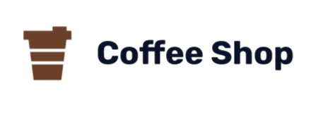

<div id="top"></div>

<!-- PROJECT LOGO -->
<br />
<div align="center">
  <a href="https://github.com/roufurrohim/Coffee-Shop-with-React">
    
  </a>

  <h3 align="center">Coffee Shop</h3>

  <p align="center">
    Coffee Shop is a simple point of sale web application.
    <br />
    <a href="https://coffee-shop-eight-puce.vercel.app/">View Demo</a>
    ·
    <a href="https://github.com/roufurrohim/Coffee-Shop-with-React">Report Bug</a>
    ·
    <a href="https://github.com/roufurrohim/Coffee-Shop-with-React">Request Feature</a>
  </p>
</div>


<!-- TABLE OF CONTENTS -->
<details>
  <summary>Table of Contents</summary>
  <ol>
    <li>
      <a href="#about-the-project">About The Project</a>
      <ul>
        <li><a href="#built-with">Built With</a></li>
      </ul>
    </li>
    <li><a href="#demo">Demo</a></li>
    <li>
      <a href="#getting-started">Getting Started</a>
      <ul>
        <li><a href="#prerequisites">Prerequisites</a></li>
        <li><a href="#installation">Installation</a></li>
      </ul>
    </li>
    <li><a href="#usage">Usage</a></li>
    <li><a href="#roadmap">Roadmap</a></li>
    <li><a href="#gallery-project">Gallery Project</a></li>
  </ol>
</details>


<!-- ABOUT THE PROJECT -->
## About The Project

This Coffee Shop app is built using the ReactJS framework,
with the addition of reactstrap for responsive display, and react-router-dom for page switching management and also for data management on the frontend using redux. This website has 2 versions for User and for Admin.

<p align="right">(<a href="#top">back to top</a>)</p>

### Built With

* [React.js](https://reactjs.org/)
* [Redux](https://redux.js.org/)
* [React-Redux](https://react-redux.js.org/)
* [React-Router-Dom](https://reactrouter.com/web/guides/quick-start)
* [Reactstrap](https://svelte.dev/)

<p align="right">(<a href="#top">back to top</a>)</p>


<!-- GETTING STARTED -->
<div id="demo"></div>

## View Demo
This is a link to demo [Coffee Shop](https://coffee-shop-eight-puce.vercel.app/)
- Login as user
  ```
  email: zulaikha17@gmail.com
  pass: 123abc
  ```
- Login as admin
  ```
  email: admin@mail.com
  pass: 123abc
  ```

<!-- GETTING STARTED -->
<div id="getting-started"></div>

## Getting Started

### Prerequisites
* npm
  ```sh
  npm install npm@latest -g
  ```

### Installation

1. Get & Clone a API Key at [Backend for this project ](https://github.com/roufurrohim/cf-backend)
2. Clone the repo
   ```sh
   git clone https://github.com/roufurrohim/Coffee-Shop-with-React
   ```
3. Install NPM packages
   ```sh
   npm install
   ```
4. Create your API in file `.env`
   ```.env
   REACT_APP_API_URL= 'YOUR API URL'
   ```

<p align="right">(<a href="#top">back to top</a>)</p>


<!-- ROADMAP -->
<div id="roadmap"></div>

## Roadmap

- [x] Clone repository [backend](https://github.com/roufurrohim/tester)
- [x] Add file environtment
- [ ] Clone this repository [frontend](https://github.com/roufurrohim/Coffee-Shop-with-React)
- [x] Add file environtment
- [ ] Run Backend with `node app.js`
- [ ] Run this project with `npm start`
- [ ] Sign Up or Login

<p align="right">(<a href="#top">back to top</a>)</p>

<!-- Gallery Project -->
<div id="gallery-project"></div>

## Gallery Project

Below is a sample screenshot of the App Coffee Shop website and mobile display for users.

Website Home | Mobile Home
----------------------|---------------------
| 


Website Register | Mobile Register
----------------------|--------------------
 | 

Website Login | Mobile Login
----------------------|--------------------
|


Website Products | Mobile Products
-------------------|----------------------
|
|


Website Details Products |Mobile Details Products
-------------------------|-----------------------
|
|


Website Cart|Mobile Cart
--------------------|----------------------
|
|


Website History|Mobile History
-------------------------|--------------------
|
|

>When view details is clicked, there will be a pop up for transaction details


Website Profile|Mobile Profile
-------------------|--------------------
|
|


>Below is a sample screenshot of the App Coffee Shop website and mobile display for Admin:

Website Home|Website Products
---------------------|--------------------
|

>On this Products page there is a Add Products feature

Details Products|Details Products
---------------------|--------------------
|

>On this page there is a feature to edit products and delete products

<p align="right">(<a href="#top">back to top</a>)</p>